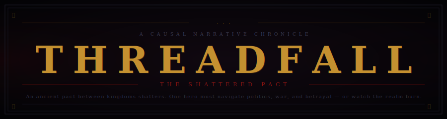

<div align="center">



<br/>

[](https://python.org)
[](https://fastapi.tiangolo.com)
[](https://react.dev)
[](https://pgmpy.org)
[](https://huggingface.co)

</div>

<br/>

**Threadfall** is a solo narrative RPG where story outcomes are governed not by dice — but by cause and effect. Built as a portfolio piece demonstrating **Judea Pearl's causal hierarchy** applied to interactive fiction, every consequence flows from a transparent, auditable causal graph. The LLM never decides what happens; it only narrates what the engine has already determined.

<br/>

<div align="center"></div>

<br/>

## ❖ &nbsp; The Core Philosophy

<br/>

<div align="center">

*"The difference between seeing and doing."*
<br/>
— Judea Pearl, **The Book of Why**

</div>

<br/>

Most AI games hand the language model the wheel. Threadfall inverts this: **the causal engine is the author; the LLM is the voice.** This separation guarantees that outcomes are reproducible, interpretable, and mathematically grounded — not hallucinated.

```
                            Player Input
                                 │
                                 ▼
          ┌──────────────┐  ┌───────────────┐  ┌──────────────────┐
          │  Classifier  │─▶│ Character     │─▶│   Causal DAG     │
          │ intent→type  │  │ stats→outcome │  │   do() surgery   │
          └──────────────┘  └───────────────┘  └────────┬─────────┘
                                                         │ topological
                                                         │ propagation
                                              ┌──────────▼──────────┐
                                              │  Bayesian Network   │
                                              │  belief update      │
                                              └──────────┬──────────┘
                                                         │
                                              ┌──────────▼──────────┐
                                              │   LLM Narrator      │
                                              │   prose only        │
                                              └─────────────────────┘
```

<br/>

<div align="center"></div>

<br/>

## ⚔ &nbsp; Pearl's Causal Hierarchy

<br/>

The engine implements all three rungs of the *Ladder of Causation*:

| &nbsp; | Rung | Operation | Question Asked | In-Game Example |
|--------|------|-----------|----------------|-----------------|
| 👁 | **Association** | `P(Y \| X)` | *What is?* | What is faction loyalty right now? |
| ✋ | **Intervention** | `P(Y \| do(X))` | *What if I do?* | If I attack, what changes? |
| 💭 | **Counterfactual** | `P(Yₓ \| X′, Y′)` | *What if I had?* | Would the pact have held if I had spoken first? |

<br/>

### The `do()` Operator — Graph Surgery

When a player acts, the engine **cuts all incoming edges** to the intervened node, forces it to the determined outcome value, then propagates causally downstream in topological order.

```python
# dag.py — structural intervention
def do(self, node_id: str, outcome: str) -> InterventionLog:
    # 1. Set action node to the sampled outcome
    # 2. Walk topological order — propagate each affected child
    # 3. Gate milestones behind score thresholds (≥0.65 / ≥0.88)
    # 4. Gate final_outcome behind all milestone resolution
```

**Propagation formula** — a weighted sigmoid maps causal pressure to state transitions:

```
push_score =  Σ [ (parent_state_idx / (n_states − 1)) × edge_weight ]
            ÷  Σ edge_weight

sigmoid(x) = 1 / (1 + e^(−k × (x − 0.5)))     k = 6

target_state_idx = round( sigmoid(push_score) × (n_states − 1) )
```

The sigmoid is non-linear but fully auditable — the same inputs always produce the same state.

<br/>

<div align="center"></div>

<br/>

## 🗺 &nbsp; Causal DAG — *The Shattered Pact*

<br/>

**20 nodes · 26 edges · 5 acts**

```
 ┌─────────────────────────────────────────────────────────┐
 │  ACTION NODES           (player decisions)              │
 │  combat_outcome · npc_interaction · resource_use        │
 │  espionage_action · political_action                    │
 ├─────────────────────────────────────────────────────────┤
 │  STATE NODES            (world conditions)              │
 │  player_health · enemy_defeated · npc_trust             │
 │  town_reputation · gold_remaining · item_inventory      │
 │  faction_loyalty · secret_knowledge                     │
 │  conflict_status · pact_integrity                       │
 ├─────────────────────────────────────────────────────────┤
 │  MILESTONE NODES        (act gates, sequential)         │
 │  act1 → act2 → act3 → act4                             │
 ├─────────────────────────────────────────────────────────┤
 │  OUTCOME NODE                                           │
 │  final_outcome  (story_failure│story_neutral│victory)  │
 └─────────────────────────────────────────────────────────┘
```

### Act Gating — Three Layers of Pacing

Acts cannot be rushed. A milestone advances only when all three conditions pass:

| Layer | Rule |
|-------|------|
| **Score threshold** | push_score ≥ 0.65 to reach `incomplete`; ≥ 0.88 for `complete` |
| **One-step enforcement** | at most one state advance per action — no skipping |
| **Sequential lock** | `actN_milestone` blocked until `act(N−1)_milestone` ≥ `partial` |

The `final_outcome` node has an additional hard gate: it cannot resolve until **all four act milestones** are past `incomplete`.

<br/>

<div align="center"></div>

<br/>

## 🎲 &nbsp; Character & Probability

<br/>

### Ability Modifiers — D&D 5e Formula

```
modifier(score) = ⌊(score − 10) / 2⌋
```

Modifiers are colour-coded live in the UI as you type: **gold** for positive, **crimson** for negative, parchment for zero.

Each action type draws on specific ability scores:

| Action Type | Primary | Secondary |
|-------------|---------|-----------|
| `combat_outcome` | Strength | Constitution |
| `npc_interaction` | Charisma | Wisdom |
| `resource_use` | Intelligence | — |
| `espionage_action` | Dexterity | Intelligence |
| `political_action` | Charisma | Intelligence |

### Success Probability — Sigmoid with Compression

```
normalised = (modifier + 5) / 10         maps modifier [−5, +5] → [0, 1]
p          = sigmoid(normalised, k=8)

p_success  = p ^ 1.5       compressed — high stats don't guarantee success
p_failure  = (1 − p) ^ 1.5
p_partial  = 1 − p_success − p_failure
```

The exponentiation means even a STR 20 Fighter can fail a combat roll. No outcome is certain.

<br/>

<div align="center"></div>

<br/>

## 🔮 &nbsp; Bayesian Network — World Beliefs

<br/>

The engine runs a **discrete Bayesian Network** (via `pgmpy`) alongside the structural DAG. While the DAG tracks *determined state*, the BN tracks *probabilistic belief* over nodes not yet intervened on.

**CPTs are auto-generated** from DAG edge weights using Dirichlet-smoothed softmax:

```python
for each child node c with parents p₁, p₂, …, pₖ:
    for each parent configuration:
        scores[state_i] = w_i × (state_i_idx / (n_states − 1))
        cpt[config]     = softmax(scores + α)    # α = 0.1  Dirichlet smoothing
```

After each `do()` call, **Variable Elimination** recomputes marginal distributions over all non-intervened nodes. These percentages appear live in the Causal Web panel on the left.

<br/>

<div align="center"></div>

<br/>

## 🗡 &nbsp; Action Classifier

<br/>

Maps free-text player input to one of five canonical action types using **verb-first weighted keyword matching** — no API call, no latency.

> **Why verb-first?** The primary verb signals intent more reliably than noun context.
> *"Ask the soldiers about the ambush"* → `npc_interaction` (not `combat_outcome`),
> even though "soldiers" and "ambush" carry combat associations.

```python
_RULES = [
    # Highest specificity first
    ("espionage_action", 2.0, ["sneak", "infiltrate", "eavesdrop", ...]),
    ("political_action", 2.0, ["declare", "proclaim", "invoke", ...]),
    ("npc_interaction",  2.0, ["ask", "tell", "persuade", "warn", ...]),   # ← social verbs win
    ("combat_outcome",   2.0, ["attack", "strike", "slash", ...]),
    # Nouns are secondary evidence only
    ("npc_interaction",  1.0, ["guard", "soldier", "noble", ...]),
    ("combat_outcome",   1.0, ["sword", "blade", "ambush", ...]),
]

confidence = best_score / Σ all_scores
```

<br/>

<div align="center"></div>

<br/>

## 📜 &nbsp; LLM Narrator

<br/>

The narrator receives **pre-determined facts** and produces prose. It cannot change an outcome, invent a consequence, or contradict the causal graph.

| Setting | Value |
|---------|-------|
| **Model** | `Qwen/Qwen2.5-7B-Instruct` (featherless-ai via HF InferenceClient) |
| **Fallbacks** | Qwen2.5-3B → Llama-3.2-3B → Phi-3.5-mini |
| **Temperature** | 0.85 |
| **Max tokens** | 600 |

**Structured output format** — enforced by system prompt, parsed with regex:

```
TITLE: <4–7 word dark chapter title, specific to this moment>
PARA1: <3–4 sentences — physical action and immediate sensory result>
PARA2: <Exactly 3 sentences — ONE concrete causal hint, not yet resolved>
```

`TITLE` → scene banner in the UI. `PARA1 + PARA2` → narrative prose.
Fallback (no HF token): tone-matched prose generated locally from outcome type.

<br/>

<div align="center"></div>

<br/>

## ⚄ &nbsp; Character Randomizer

<br/>

The **⚄ Randomize** button calls `GET /randomize_character`. The backend queries the same LLM with a structured prompt requesting a morally complex, gothic character in fixed key-value format:

```
NAME: Serath          CLASS: Warlock       RACE: Tiefling    LEVEL: 3
STR: 10  DEX: 14  CON: 12  INT: 15  WIS: 9  CHA: 17
BACKSTORY: <2 dark, specific sentences>
```

Response is regex-parsed, stats clamped to `[8, 18]`. A curated local fallback fires if the LLM is unavailable. All fields remain editable after randomization.

<br/>

<div align="center"></div>

<br/>

## 🏛 &nbsp; Architecture

<br/>

```
Threadfall/
├── backend/
│   ├── main.py                        FastAPI — all endpoints + randomizer
│   ├── causal_engine/
│   │   ├── dag.py                     CausalDAG, do() operator, topological propagation
│   │   └── campaigns/long.json        "The Shattered Pact" — 20 nodes, 26 edges, 5 acts
│   ├── pgm_engine/
│   │   ├── world_state.py             Bayesian Network, CPT generation, belief update
│   │   └── character.py              CharacterSheet, stat → probability mapping
│   ├── llm/
│   │   ├── narrator.py               HuggingFace InferenceClient, structured prose
│   │   └── classifier.py            Verb-first keyword classifier, 5 action types
│   └── models/schemas.py             Pydantic request / response schemas
│
└── frontend/
    ├── src/
    │   ├── App.jsx                    Character creation, live modifiers, randomizer
    │   ├── components/
    │   │   ├── GameView.jsx           Three-panel layout (Graph | Narrative | Stats)
    │   │   ├── NarrativeFeed.jsx      Scrolling log — outcome badges, causal chips
    │   │   ├── StatsPanel.jsx         D&D stat block with live modifiers
    │   │   └── CausalGraph.jsx        Cytoscape.js DAG visualisation
    │   ├── api.js                     fetch wrappers for backend endpoints
    │   ├── dagMeta.json               Static graph structure for Cytoscape rendering
    │   └── index.css                 Gothic CSS palette — Cinzel + IM Fell English
    └── tailwind.config.js
```

<br/>

<div align="center"></div>

<br/>

## ⚙ &nbsp; Setup

<br/>

**Prerequisites:** Python 3.11+ &nbsp;·&nbsp; Node.js 18+ &nbsp;·&nbsp; npm or pnpm

### Backend

```bash
cd Threadfall
pip install -r requirements.txt
uvicorn backend.main:app --reload --port 8000
```

Set your HuggingFace token for LLM narration *(optional — fallback prose works without it)*:

```bash
# Windows PowerShell
$env:HF_TOKEN = "hf_your_token_here"

# bash / macOS / Linux
export HF_TOKEN=hf_your_token_here
```

### Frontend

```bash
cd frontend
npm install
npm run dev
# → http://localhost:5173
```

<br/>

<div align="center"></div>

<br/>

## 🔗 &nbsp; API Reference

<br/>

| Method | Endpoint | Description |
|--------|----------|-------------|
| `POST` | `/new_game` | Start session — returns initial world state |
| `POST` | `/action` | Full causal pipeline for one player action |
| `GET` | `/session/{id}` | Current session state (reconnect / refresh) |
| `DELETE` | `/session/{id}` | Clean up session |
| `GET` | `/randomize_character` | LLM-generated D&D character |

### `/action` Pipeline — 9 Steps Per Input

```
1. Classify player text   →  canonical action type + confidence
2. Map action type        →  relevant ability stat
3. Compute probability    →  sigmoid over stat modifier
4. Sample outcome         →  seeded RNG  →  success / partial / failure
5. DAG.do()               →  graph surgery + topological propagation
6. BN belief update       →  Variable Elimination over all nodes
7. Advance act            →  if milestone complete; advance scene index
8. LLM narrate            →  pre-determined facts only — no decision authority
9. Check campaign over    →  all milestones resolved?
```

<br/>

<div align="center"></div>

<br/>

## 🎓 &nbsp; Concepts & References

<br/>

| Concept | Source |
|---------|--------|
| Pearl's Causal Hierarchy | *The Book of Why* — Pearl & Mackenzie (2018) |
| do-Calculus & Graph Surgery | *Causality* — Judea Pearl (2000) |
| Backdoor / Frontdoor Criterion | Pearl (1995) |
| D&D 5e Ability Modifier Formula | *Player's Handbook* — Wizards of the Coast (2014) |
| Discrete Bayesian Networks & CPTs | `pgmpy` — Ankan & Panda (2015) |
| Variable Elimination Inference | Russell & Norvig, *AIMA* Ch. 13 |
| Verb-first Intent Classification | Fillmore Frame Semantics |
| Structured LLM Output Parsing | TITLE / PARA1 / PARA2 format with regex |

<br/>

<div align="center"></div>

<br/>

## ✦ &nbsp; Design Principles

<br/>

**The Engine Decides. The LLM Narrates.**
The model is a voice actor, not a playwright. It receives a packet of pre-determined facts — outcome, probability, causal consequences — and writes prose around them. It cannot alter a result.

**Transparency is the Feature.**
Every outcome badge shows the action type, the ability stat, and the exact probability. Every downstream effect appears as a chip. The full DAG is visible at all times in the Causal Web panel.

**Pacing is a First-Class Constraint.**
Three layers of gating — score thresholds, one-step advancement, sequential act locks — ensure the story breathes at a human pace. Acts cannot be rushed.

**Reproducibility.**
Each session is seeded. Given the same seed and the same player inputs, the same outcomes occur every time. The game is deterministic beneath its gothic surface.

<br/>

<div align="center">


<br/><br/>

<sub>Built with Pearl's causal hierarchy · pgmpy · FastAPI · React · Tailwind · HuggingFace Inference API</sub>

<br/>

<sub>A portfolio project by <strong>Kai</strong> — MSc ML/AI, TU Darmstadt</sub>

<br/><br/>

</div>
